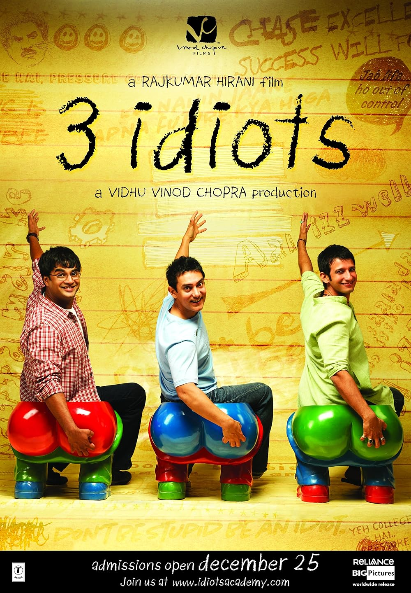

# app-dev
My first repository
**The three idiots**
*3 Idiots is a 2009 Indian Hindi-language coming-of-age satirical comedy-drama film written, edited and directed by Rajkumar Hirani, co-written by Abhijat Joshi and produced by Vidhu Vinod Chopra. The film stars Aamir Khan, R. Madhavan and Sharman Joshi in the title roles, while Kareena Kapoor, Boman Irani, Mona Singh and Omi Vaidya play supporting roles. Narrated through two parallel timelines, one in the present and the other set ten years earlier, the story follows the friendship of three students at an Indian engineering college and is a satire about the intrinsic paternalism under the Indian education system.*
Corny neto sir! 😆:

